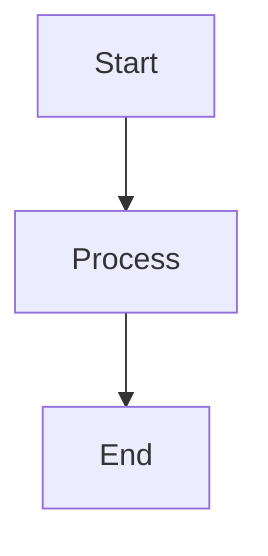

# davidslv.github.com

Personal blog and portfolio site built with [Jekyll](https://jekyllrb.com/) and hosted on [GitHub Pages](https://pages.github.com/).

This repository contains the source code for the blog, which is automatically built and published by GitHub Pages whenever changes are pushed to the `master` branch.

## 🚀 Quick Start

### Prerequisites

- Ruby 2.7+ (check with `ruby --version`)
- Bundler gem (install with `gem install bundler`)

### Local Setup

1. **Clone the repository:**
   ```bash
   git clone https://github.com/davidslv/davidslv.github.com.git
   cd davidslv.github.com
   ```

2. **Install dependencies:**
   ```bash
   bundle install
   ```

3. **Start the Jekyll development server:**
   ```bash
   bundle exec jekyll serve -P 3333
   ```

4. **View the site:**
   Open your browser to [http://localhost:3333](http://localhost:3333)

The site will automatically rebuild when you make changes to source files.

## 📝 Writing Blog Posts

### Creating a New Post

1. **Create a new file in `_posts/` directory:**
   - Filename format: `YYYY-MM-DD-post-title.markdown`
   - Example: `2025-11-05-my-new-post.markdown`

2. **Add front matter (YAML header):**
   ```markdown
   ---
   layout: post
   title:  "Your Post Title"
   date:   2025-11-05 21:40:00
   categories: ruby development
   tags: [ruby rails performance]
   ---

   Your post content starts here...
   ```

3. **Write your content in Markdown:**
   - Use standard Markdown syntax
   - Code blocks are supported with syntax highlighting
   - Mermaid diagrams are supported (see below)

### Post Front Matter Options

- **`layout`**: Always use `post` for blog posts
- **`title`**: The post title (displayed in browser and post heading)
- **`date`**: Publication date (format: `YYYY-MM-DD HH:MM:SS`)
- **`categories`**: Space-separated categories (determines URL structure)
- **`tags`**: Array of tags for categorization

### Mermaid Diagrams

This blog supports [Mermaid.js](https://mermaid.js.org/) diagrams. Include them in your posts using code blocks:

````markdown

````

The diagrams will automatically render when the page loads. See the [Mermaid documentation](https://mermaid.js.org/intro/) for all diagram types.

## 🏗️ Repository Structure

```
.
├── _config.yml          # Jekyll configuration
├── _includes/           # Reusable HTML components
│   ├── head.html        # HTML head (includes Mermaid.js)
│   ├── header.html      # Site header
│   └── footer.html      # Site footer
├── _layouts/            # Page templates
│   ├── default.html     # Default layout
│   ├── page.html        # Static page layout
│   └── post.html        # Blog post layout
├── _posts/              # Blog posts (markdown files)
├── _sass/               # SCSS stylesheets
│   ├── _base.scss       # Base styles
│   ├── _layout.scss    # Layout styles (includes Mermaid styling)
│   └── _syntax-highlighting.scss
├── css/                 # Main stylesheet entry point
│   └── main.scss
├── img/                 # Images and assets
├── about.md             # About page
├── index.html           # Homepage
├── feed.xml             # RSS feed
├── CNAME                # Custom domain configuration
├── Gemfile              # Ruby dependencies
└── README.md            # This file
```

## 🌐 Publishing

### How GitHub Pages Works

GitHub Pages automatically builds and publishes this site when you push changes to the `master` branch:

1. **Push to GitHub:**
   ```bash
   git add .
   git commit -m "Your commit message"
   git push origin master
   ```

2. **GitHub Pages automatically:**
   - Detects the push to `master` branch
   - Runs `bundle install` to install dependencies
   - Runs `bundle exec jekyll build` to build the site
   - Publishes the `_site/` directory to the web
   - Site is live at `https://davidslv.github.io` (or your custom domain)

3. **Build Status:**
   - Check build status in the "Actions" tab of your GitHub repository
   - Build logs show any errors or warnings
   - Typical build time: 1-3 minutes

### Custom Domain

The site is configured to use a custom domain (`davidslv.uk`):

- The `CNAME` file specifies the custom domain
- DNS must be configured to point to GitHub Pages
- SSL certificate is automatically provisioned by GitHub

### Local Build (Optional)

To build the site locally without running the server:

```bash
bundle exec jekyll build
```

This generates the `_site/` directory with static HTML files. **Note:** The `_site/` directory is not committed to git (it's build output).

## 🔧 Development

### Running Locally

```bash
# Start development server with auto-reload
bundle exec jekyll serve

# Start with drafts visible
bundle exec jekyll serve --drafts

# Start with future-dated posts
bundle exec jekyll serve --future
```

### Dependencies

Dependencies are managed via `Gemfile`:

- **github-pages**: Includes Jekyll and all plugins supported by GitHub Pages
- Automatically locks to versions compatible with GitHub Pages

Update dependencies:
```bash
bundle update
```

### Jekyll Configuration

Site settings are in `_config.yml`:

- Site title, description, and author info
- Base URL and domain
- Markdown processor (kramdown)
- Social media links

**Important:** After changing `_config.yml`, restart the Jekyll server.

## ✨ Features

- ✅ **Markdown-based content** - Write posts in Markdown
- ✅ **Mermaid diagrams** - Visual diagrams in blog posts
- ✅ **Syntax highlighting** - Code blocks with syntax highlighting
- ✅ **RSS feed** - Automatic RSS feed generation
- ✅ **Responsive design** - Mobile-friendly layout
- ✅ **Custom domain** - Configured for `davidslv.uk`
- ✅ **Category-based URLs** - Posts organized by category
- ✅ **Tag support** - Tag posts for better organization

## 📚 Resources

- [Jekyll Documentation](https://jekyllrb.com/docs/)
- [GitHub Pages Documentation](https://docs.github.com/en/pages)
- [Mermaid.js Documentation](https://mermaid.js.org/)
- [Kramdown Markdown Syntax](https://kramdown.gettalong.org/syntax.html)

## 🐛 Troubleshooting

### Jekyll won't start

- Ensure Ruby and Bundler are installed
- Run `bundle install` to install dependencies
- Check Ruby version compatibility (2.7+)

### Changes not showing up

- Restart the Jekyll server after changing `_config.yml`
- Clear browser cache (hard refresh: Cmd+Shift+R / Ctrl+Shift+R)
- Check for build errors in terminal output

### Mermaid diagrams not rendering

- Check browser console for JavaScript errors
- Ensure Mermaid.js CDN is accessible
- Verify code block syntax: ` ```mermaid ` (with language specified)

### Build fails on GitHub Pages

- Check GitHub Actions tab for build logs
- Ensure `Gemfile` and `Gemfile.lock` are committed
- Verify Jekyll version compatibility with GitHub Pages

## 📝 License

All content and code in this repository are the property of the author unless otherwise stated.

## 🤝 Contributing

This is a personal blog repository. If you find issues or have suggestions, feel free to open an issue or submit a pull request.

---

**Built with ❤️ using Jekyll and GitHub Pages**


