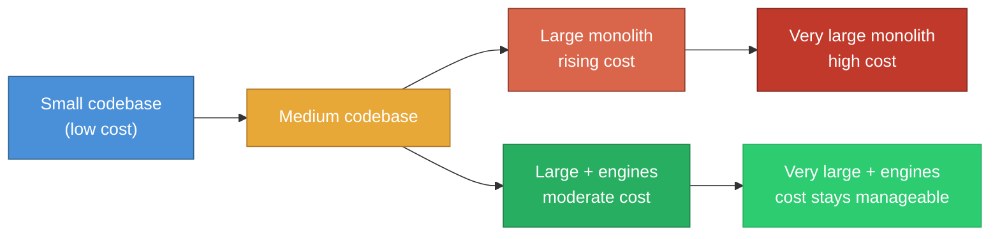
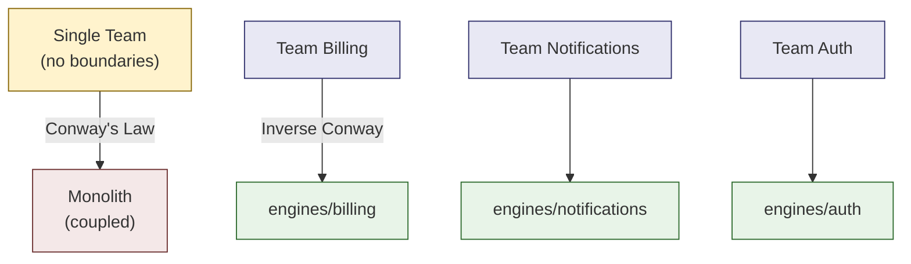

*This is an adapted excerpt from Chapter 1 of [Modular Rails: Architecture for the Long Game](/modular-rails/), my book on building maintainable Ruby on Rails applications using Rails Engines.*

---

> *"The goal of software architecture is to minimize the human resources required to build and maintain the required system."*
> -- Robert C. Martin, *Clean Architecture*

## The Cost of Change Over Time

Every Rails developer has lived this story. The application starts small. A handful of models, a few controllers, a test suite that runs in seconds. Adding a feature is straightforward -- you create a model, write a migration, build a controller, add some views. The framework guides you. Convention over configuration. Life is good.



Then the application grows. The `app/models` directory fills up. The `User` model gains associations to everything. Service objects proliferate in `app/services/`. Someone introduces an `app/interactors/` directory. Then `app/queries/`. Then `app/decorators/`. Each new directory is a well-intentioned attempt to manage complexity, but none of them create actual boundaries. Everything can still reference everything.

At this point, the cost of change starts to climb. Not linearly -- exponentially. A small change to the billing logic triggers test failures in the notification suite. A database migration for user preferences locks a table that the checkout flow depends on.

Let's make this concrete. You add a discount field to invoices -- a straightforward billing change:

```
$ bin/rails test test/models/billing/invoice_test.rb
# 3 tests, 3 assertions, 0 failures

$ bin/rails test
# 847 tests, 1203 assertions, 4 failures
# Failures in: notification_mailer_test.rb, report_generator_test.rb,
#              admin_dashboard_test.rb, webhook_handler_test.rb
```

Four failures in four files that have nothing to do with discounts. None of these files are in the `billing/` directory. None of them showed up when you grepped for the code you changed. But they all reached into the invoice model directly, without going through any kind of boundary.

Now imagine the same change in a codebase where billing lives inside an engine:

```
$ cd engines/billing && bundle exec rspec
# 94 examples, 0 failures

$ cd ../.. && bundle exec rspec
# 312 examples, 0 failures
```

Zero collateral damage. The engine's boundary means billing tests only load billing code. If the billing tests pass, the change is safe.

This is not a Rails problem. This is an architecture problem. Or more precisely, it's the absence of architecture.

## Conway's Law and Team Structure

In 1968, Melvin Conway observed that *"any organization that designs a system will produce a design whose structure is a copy of the organization's communication structure."*



If your team is structured as a single unit working on a single codebase with no internal boundaries, the application will reflect that: a single, undifferentiated mass where everything knows about everything.

But Conway's Law also works in reverse -- the "Inverse Conway Manoeuvre" (coined by Jonny LeRoy and Matt Simons in 2010, and later popularised by James Lewis and Martin Fowler). If you structure your codebase into well-bounded modules, each with a clear domain and interface, you create natural team boundaries. The billing engine has an owner. The notification engine has an owner. Changes to billing don't require coordination with the notification team because the engine boundary makes the coupling explicit and manageable.

In a Rails context, this means that your `app/` directory structure isn't just a filing system. It's an organisational decision. And `app/models/` with 200 files in it is an organisational decision that says "everyone works on everything, and good luck coordinating."

## Deferring Decisions

Perhaps the most counterintuitive idea in software architecture comes from Robert C. Martin:

> *"A good architect pretends that the decision has not been made, and shapes the system such that those decisions can still be deferred or changed for as long as possible."*

Here's what a deferred decision looks like in code. Your billing engine needs a payment gateway, but the right choice depends on which markets you'll launch in -- information you don't have yet:

```ruby
# engines/billing/lib/billing.rb
module Billing
  mattr_accessor :payment_gateway, default: "Billing::Gateways::Stripe"
end
```

The business logic calls `Billing.payment_gateway.constantize.new` and never mentions Stripe, Adyen, or anyone else by name. When the business decides to expand into a market where Stripe isn't available, you write a new gateway class and change one line of configuration. No billing logic changes. No tests break.

That boundary is itself a deferred decision. By keeping billing isolated in an engine, you've deferred the decision about whether billing should be a separate service, a separate application, or remain part of the monolith. You can make that decision later, with more information, at lower cost.

This is the essence of good architecture: not making the perfect decision now, but structuring the system so that you can make the right decision later.

---

*This was Chapter 1 of [Modular Rails: Architecture for the Long Game](/modular-rails/). The book covers 18 chapters across four parts -- from Clean Architecture principles to extracting your first engine, testing strategies, team workflow, and the honest trade-offs most architecture books skip.*

<!-- TODO: Replace with actual Amazon link once published -->
*[Get the book](/modular-rails/)*
