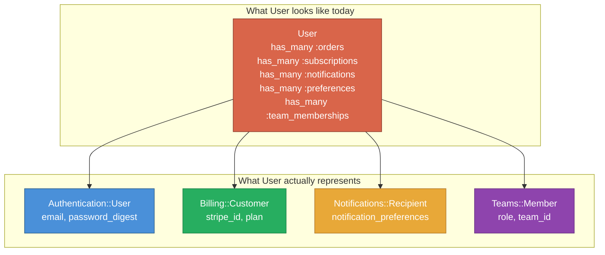
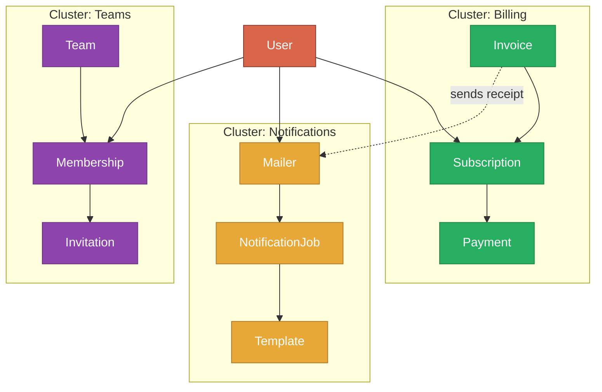

*This is an adapted excerpt from Chapter 9 of [Modular Rails: Architecture for the Long Game](/modular-rails/), my book on building maintainable Ruby on Rails applications using Rails Engines.*

---

You know your Rails monolith needs structure. The `app/models` directory has 200 files, every model seems to depend on every other model, and a change to billing breaks notification tests. But where do you draw the lines?

This is the question that stops most teams from ever starting. They read about bounded contexts and domain-driven design, nod along, and then stare at their codebase with no idea where to begin. The good news: your codebase already contains the answers. You just need to know how to read them.

## The "Change Together" Heuristic

The most reliable signal for where boundaries belong is not in the code itself -- it is in the history of how the code changes. Files that change together belong together. Files that change independently are already naturally separated.

This is not a new idea. Michael Feathers calls it "co-change analysis" and it is one of the most underused tools in a Software Engineer's toolkit. The principle is simple: if two files appear in the same commit repeatedly, they are coupled -- regardless of what the code looks like.

There are three reasons files change together:

1. **They implement the same domain concept.** A billing invoice model, its controller, and its serialiser change together because they all express the billing domain. These files belong in the same engine.

2. **One depends on the other through a shared interface.** A notification mailer changes when the user model changes because it reads user attributes directly. This coupling is a signal that you need a cleaner interface between users and notifications.

3. **They share a hidden assumption.** Two files both assume that a "plan" has a `monthly_price` field. When the pricing model changes, both break. This is the most dangerous kind of coupling because it is invisible until something goes wrong.

## Finding Co-Change Clusters with Git

Your git history is a goldmine. Here is a bash one-liner that shows you which files change most frequently:

```bash
git log --pretty=format: --name-only --since="6 months ago" \
  | sort | uniq -c | sort -rn | head -30
```

This gives you a ranked list of the most frequently changed files. But frequency alone is not enough -- you want to know which files change *together*. Here is a Ruby script that finds co-change pairs:

```ruby
#!/usr/bin/env ruby
# co_change_analysis.rb
# Usage: ruby co_change_analysis.rb [months_back]

months = ARGV[0] || 6
commits = `git log --pretty=format:"%H" --since="#{months} months ago"`.split("\n")

pairs = Hash.new(0)

commits.each do |sha|
  files = `git diff-tree --no-commit-id --name-only -r #{sha}`.split("\n")
  files = files.select { |f| f.start_with?("app/") }

  files.combination(2).each do |a, b|
    key = [a, b].sort
    pairs[key] += 1
  end
end

pairs.sort_by { |_, count| -count }.first(30).each do |pair, count|
  puts "#{count}\t#{pair.join(' <-> ')}"
end
```

Run this on your codebase and you will see clusters emerge. The billing model and billing controller change together. The notification mailer and the notification job change together. But you will also see surprising couplings: the user model changes with *everything* because it has become the God Object of your application.

## The User Model: A Composition Point

In almost every Rails application, the `User` model is the most coupled class. It has associations to orders, subscriptions, notifications, preferences, teams, audit logs -- everything. This is not a single domain concept. It is a composition point where multiple bounded contexts meet.



The `User` model is not one thing. It is four (or five, or ten) things wearing a trench coat. Each bounded context needs a different slice of user data, and the current design forces all of them to go through the same 500-line model.

When you extract engines, the User model becomes a composition point. Each engine defines what it needs from a user through a minimal interface -- a concern, a protocol, or a foreign key -- rather than depending on the entire User class.

## Visualising the Dependency Graph

Once you have identified clusters of files that change together, map them visually. Here is what a typical Rails application looks like when you draw the domain dependencies:



Notice three things. First, the clusters are real -- billing models talk to each other far more than they talk to notification models. Second, the User sits at the centre, connecting everything. Third, the cross-cluster dependencies (the dashed line from Invoice to Mailer) are few and specific. Those cross-cluster lines are your future engine interfaces.

## A Practical Approach: Start with One

Do not try to identify all your boundaries at once. Pick the cluster that is most obviously separate -- the one where your co-change analysis shows the tightest internal coupling and the loosest external coupling. For many applications, that is billing or notifications.

Extract that one cluster into an engine. Learn what works. Learn what hurts. Then do the next one. The boundaries you draw today will be refined by what you learn tomorrow.

The codebase already knows where the boundaries are. Your job is to listen.

---

*This was adapted from Chapter 9 of [Modular Rails: Architecture for the Long Game](/modular-rails/). The book covers 18 chapters across four parts -- from Clean Architecture principles to extracting your first engine, testing strategies, team workflow, and the honest trade-offs most architecture books skip.*

*Read the [**entire book free on the web**](/books/modular-rails/) — every chapter, no paywall. Prefer print or Kindle? [Amazon US](https://www.amazon.com/dp/1066649405) · [Amazon UK](https://www.amazon.co.uk/dp/1066649405) · [all editions &amp; prices](/modular-rails/).*
