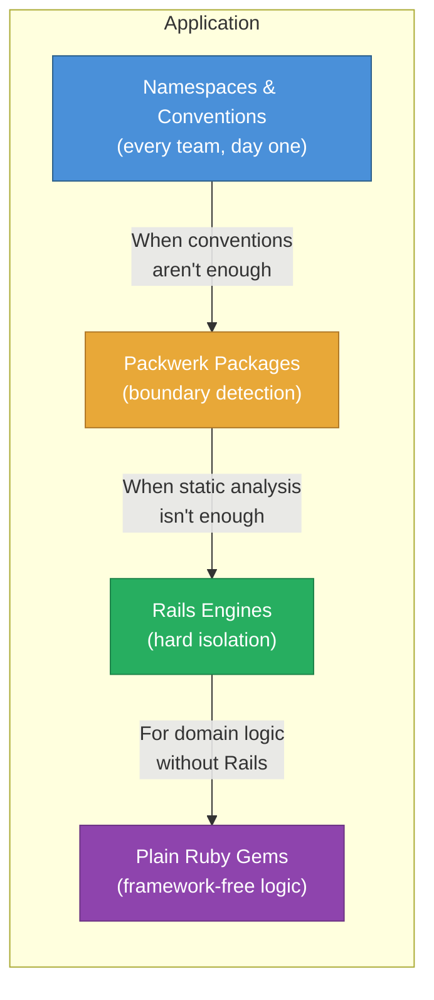

*This is an adapted excerpt from Chapter 16 of [Modular Rails: Architecture for the Long Game](/modular-rails/), my book on building maintainable Ruby on Rails applications using Rails Engines.*

---

Rails engines are not the only way to introduce structure into a monolith. Packwerk, plain Ruby gems, namespaces, and even Hanami slices offer different trade-offs. The question is not which tool is "best" -- it is which tool fits the problem you actually have.

This post focuses on the comparison that comes up most often: Rails engines versus Packwerk.

## Packwerk: Static Boundary Enforcement

Packwerk, created by Shopify, takes a fundamentally different approach to modularity. Instead of runtime isolation (separate load paths, independent gemspecs, mountable routes), Packwerk enforces boundaries at analysis time through static checks.

A package in Packwerk is a directory with a `package.yml` file:

```yaml
# components/billing/package.yml
enforce_dependencies: true
enforce_privacy: true
dependencies:
  - components/core
```

That is the entire configuration. The directory structure stays inside your existing `app/` folder. There are no gemspecs, no dummy apps, no mountable routes. You add Packwerk to an existing application and draw boundaries around code that already exists.

Packwerk then analyses your code statically -- without running it -- and reports violations:

```
components/notifications/app/models/notifications/mailer.rb:12
  Billing::Invoice is private to components/billing
```

The violation tells you that the notification mailer is reaching into billing's internals. You fix it by either making `Invoice` part of billing's public API or by introducing an interface.

## The Public API Pattern

Both engines and Packwerk benefit from explicit public APIs, but Packwerk makes this a first-class concept. You mark classes as public by placing them in a `public/` directory within your package:

```
components/billing/
  app/
    models/
      billing/
        invoice.rb          # private
        line_item.rb         # private
        payment_gateway.rb   # private
    public/
      billing/
        charge_customer.rb   # public API
        invoice_summary.rb   # public API
  package.yml
```

Other packages can only reference `Billing::ChargeCustomer` and `Billing::InvoiceSummary`. Any reference to `Billing::Invoice` directly triggers a violation. This is a powerful pattern -- it forces you to think about what your module exposes rather than what it contains.

Engines can achieve the same thing through convention and code review, but Packwerk enforces it automatically.

## When to Use Which

Here is where it gets practical. Each tool excels in different situations:

| Dimension | Rails Engines | Packwerk |
|-----------|--------------|----------|
| **Isolation** | Runtime (separate load paths, gemspecs) | Static analysis only |
| **Setup cost** | Medium-high (gemspec, dummy app, routes) | Low (add gem, create package.yml) |
| **Enforcement** | Hard -- code literally cannot see other engines without dependencies | Soft -- violations are warnings, not errors |
| **Migration path** | Must move files, update requires | Draw boundaries around existing code |
| **Independent testing** | Yes -- each engine has its own test suite | Partial -- tests still run in one suite |
| **Route isolation** | Full mountable routes | No route concept |
| **Database migrations** | Can be engine-specific | Application-level only |
| **Team ownership** | Natural -- each engine is a unit | Possible but requires tooling |
| **Extraction to service** | Straightforward -- engine is already isolated | Requires significant refactoring |

The key difference is enforcement philosophy. Engines say "you physically cannot cross this boundary." Packwerk says "we will tell you when you cross this boundary." Both are valid. The right choice depends on your team's discipline and your application's trajectory.

## Brief Mentions: Other Approaches

**Plain Ruby gems** are the lightest-weight option. If your module has no Rails dependencies -- a pricing calculator, a tax rules engine, a PDF generator -- a gem gives you complete isolation with minimal overhead. No Rails, no ActiveRecord, just Ruby.

**Namespaces and modules** cost nothing to set up. They communicate intent -- `Billing::Invoice` tells developers that this class belongs to the billing domain. But namespaces have zero enforcement. Nothing prevents `Notifications::Mailer` from calling `Billing::Invoice.find(42)`.

**Hanami slices** offer a middle ground for teams building new applications. Each slice gets its own container, dependencies, and persistence layer. The trade-off is that you are no longer writing Rails.

## Each Tool's Sweet Spot

| Tool | Best for |
|------|----------|
| **Rails Engines** | Teams that need hard boundaries, independent deployability potential, or are on the path to eventual service extraction |
| **Packwerk** | Large teams adopting modularity incrementally in an existing monolith, where moving files is too disruptive |
| **Plain Ruby gems** | Framework-agnostic domain logic with no Rails dependencies |
| **Namespaces** | Small teams with strong conventions, or as a stepping stone to stronger boundaries |
| **Hanami slices** | New applications where the team is willing to move beyond Rails conventions |

## Layering Your Tools

These tools are not mutually exclusive. In practice, many mature applications use several of them together:



You start with namespaces because they are free. When namespaces are not enough, you add Packwerk to detect boundary violations. When detection is not enough and you need enforcement, you extract an engine. When the engine contains logic that does not need Rails at all, you pull it into a plain gem.

Each layer builds on the one below. You do not have to pick one tool and commit to it forever. You escalate as the pain justifies the cost.

The best architecture teams I have worked with use this layered approach. They start cheap, escalate deliberately, and always ask: "Is the boundary problem we have worth the cost of the tool we are reaching for?"

---

*This was adapted from Chapter 16 of [Modular Rails: Architecture for the Long Game](/modular-rails/). The book covers all five approaches in depth -- with working code, migration guides, and the honest trade-offs for each.*

*Read the [**entire book free on the web**](/books/modular-rails/) — every chapter, no paywall. Prefer print or Kindle? [Amazon US](https://www.amazon.com/dp/1066649405) · [Amazon UK](https://www.amazon.co.uk/dp/1066649405) · [all editions &amp; prices](/modular-rails/).*
