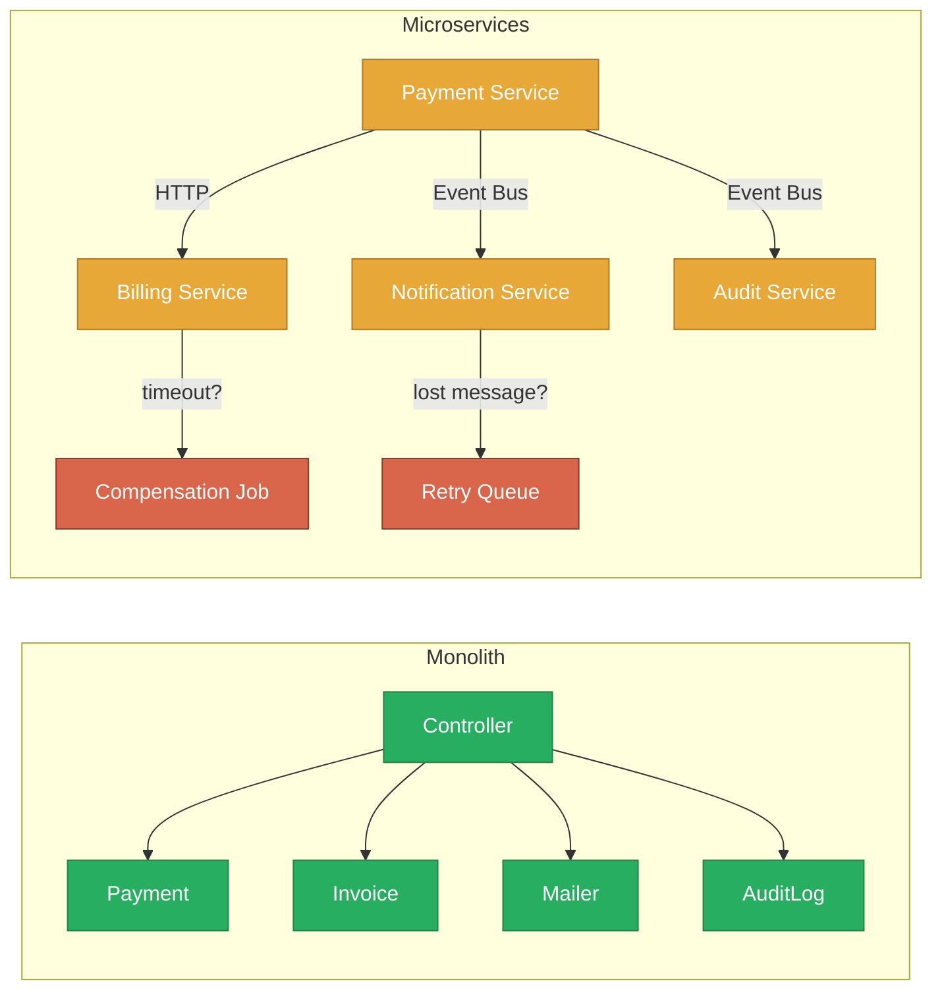
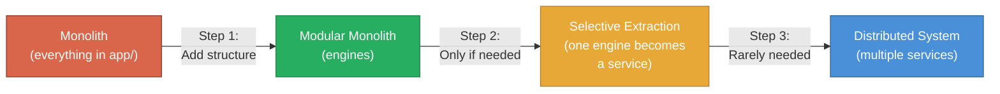
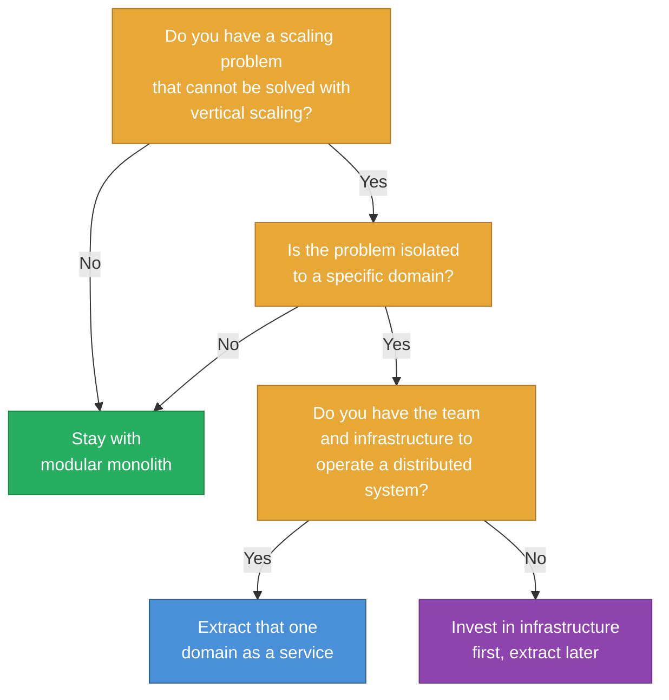

*This is an adapted excerpt from Chapter 17 of [Modular Rails: Architecture for the Long Game](/modular-rails/), my book on building maintainable Ruby on Rails applications using Rails Engines.*

---

> *"Majestic monolith. The vast majority of web applications should start here and never leave."*
> -- David Heinemeier Hansson

The microservices conversation has been going on for over a decade now, and the industry is starting to reach a consensus that most teams arrived at too late: distributed systems are expensive, and the default starting point should be a well-structured monolith.

This chapter makes the case that a modular monolith -- specifically, a Rails application structured with engines -- is the right default for most teams. Not because microservices are bad, but because the operational cost of distribution is almost always underestimated.

## The Operational Cost Nobody Talks About

Consider a simple operation: recording a payment. In a monolith, this is a method call:

```ruby
# Monolith: one process, one database, one transaction
class PaymentsController < ApplicationController
  def create
    payment = Payment.create!(payment_params)
    Invoice.find(payment.invoice_id).mark_paid!
    NotificationMailer.payment_received(payment).deliver_later
    AuditLog.record(:payment_created, payment)

    render json: payment, status: :created
  end
end
```

Four operations, one request, one database transaction. If any step fails, the transaction rolls back. The code is straightforward to write, straightforward to test, and straightforward to debug.

Now consider the same operation in a microservices architecture:

```ruby
# Microservices: four services, four databases, eventual consistency
class PaymentsController < ApplicationController
  def create
    payment = PaymentService.create(payment_params)

    # Synchronous call to billing service
    response = BillingClient.mark_invoice_paid(
      payment.invoice_id,
      idempotency_key: SecureRandom.uuid
    )
    raise BillingServiceError unless response.success?

    # Asynchronous event for notification service
    EventBus.publish("payment.created", {
      payment_id: payment.id,
      user_id: payment.user_id,
      amount: payment.amount
    })

    # Asynchronous event for audit service
    EventBus.publish("payment.created.audit", {
      payment_id: payment.id,
      action: :created,
      timestamp: Time.current.iso8601
    })

    render json: payment, status: :created
  rescue BillingClient::TimeoutError
    # What do we do? Payment is recorded but invoice is not marked paid.
    # Retry? Compensate? Queue for later?
    CompensationJob.perform_later(:payment_billing_sync, payment.id)
    render json: payment, status: :accepted  # 202, not 201
  rescue EventBus::PublishError
    # Payment and invoice are updated but notifications may not fire.
    # Is this acceptable? Depends on the business rules.
    FailedEventJob.perform_later("payment.created", payment.id)
    render json: payment, status: :created
  end
end
```

The same four operations now involve network calls, serialisation, idempotency keys, timeout handling, compensation logic, and eventual consistency. The code is three times longer, but more importantly, the failure modes have multiplied. What happens when the billing service is down? What happens when the event bus loses a message? What happens when the compensation job fails?



Every arrow in the microservices diagram is a potential failure point. Every potential failure point needs handling code, monitoring, alerting, and runbooks.

## Companies That Came Back

The most compelling argument for starting with a monolith comes from companies that tried microservices and came back:

**Amazon Prime Video** published a case study in 2023 describing how they moved from a distributed microservices architecture to a monolith for their video quality monitoring tool -- and reduced costs by 90% while improving throughput. The distributed architecture created bottlenecks at service boundaries that vanished when the code ran in a single process.

**Segment** famously migrated from a microservices architecture back to a monolith after discovering that the operational overhead of managing 120+ microservices was consuming more engineering time than feature development. Their CTO wrote candidly about how the microservices architecture that was supposed to enable faster development had become a tax on every team.

**Istio**, the service mesh project, consolidated from multiple microservices into a single binary called Istiod. Their blog post explained that the microservices architecture added operational complexity without meaningful benefits at their scale.

**Shopify** -- one of the largest Rails applications in the world -- chose a modular monolith over microservices. They invested heavily in Packwerk and component-based architecture rather than splitting into services. Their reasoning: the cost of network boundaries was not justified by the organisational benefits.

## Engines as a Stepping Stone

The modular monolith gives you the best of both worlds. You get the organisational benefits of clear boundaries -- team ownership, independent development, focused testing -- without the operational cost of distribution.

And critically, engines preserve the option to extract services later. An engine with a clean interface can become a microservice when (and only when) the operational cost is justified by a genuine need.



Most applications never get past step 2. And that is perfectly fine. The goal is not to arrive at microservices. The goal is to have a codebase that is maintainable, testable, and adaptable to whatever comes next.

## The Decision Framework

When the microservices conversation comes up -- and it will -- use this framework:



The framework is deliberately conservative. Each "No" sends you back to the monolith because the default should be the simpler architecture. You only move to a distributed system when you have a specific, measurable problem that cannot be solved any other way, and the team and infrastructure to support it.

Start with a modular monolith. Structure it well. Extract when -- and only when -- the evidence demands it.

---

*This was adapted from Chapter 17 of [Modular Rails: Architecture for the Long Game](/modular-rails/). The book covers the full microservices question including network latency, debugging, data consistency, and the complete decision framework.*

*[Get the book on Amazon UK](https://www.amazon.co.uk/dp/B0GZL7D53M) · [Amazon US](https://www.amazon.com/dp/B0GZL7D53M) · [Learn more](/modular-rails/)*
