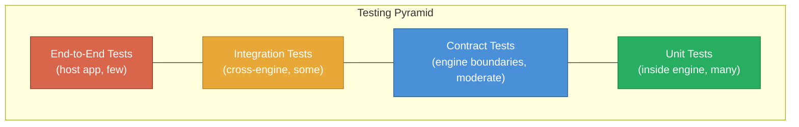
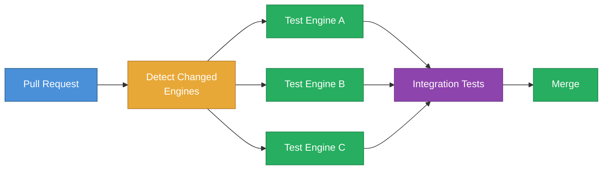

*This is an adapted excerpt from Chapter 13 of [Modular Rails: Architecture for the Long Game](/modular-rails/), my book on building maintainable Ruby on Rails applications using Rails Engines.*

---

Your test suite takes 40 minutes. Mine takes 4.

That is not because I write fewer tests. It is because when I change billing code, I only run billing tests. When I change notification code, I only run notification tests. The full suite runs in CI, but a Software Engineer working on a single engine gets feedback in seconds, not minutes.

This is the testing payoff of a modular architecture. But it does not happen automatically. Engines need a deliberate testing strategy -- one that preserves isolation while catching integration failures.

## The Testing Pyramid for Engines

The testing pyramid for a modular Rails application has an extra dimension: scope.



The bottom of the pyramid -- unit tests inside an engine -- should be the vast majority of your tests. These run fast because they only load the engine, not the entire application. Contract tests verify that the interfaces between engines work correctly. Integration tests confirm that engines compose properly. End-to-end tests are few and focused on critical user journeys.

## The Dummy App and RSpec Setup

Every engine generated by Rails includes a `test/dummy` (or `spec/dummy`) application. This is a minimal Rails app that mounts your engine, providing just enough context to run tests without loading your full application.

Here is a typical `spec/rails_helper.rb` for an engine:

```ruby
# engines/billing/spec/rails_helper.rb
require "spec_helper"

ENV["RAILS_ENV"] ||= "test"
require File.expand_path("dummy/config/environment", __dir__)

abort("The Rails environment is running in production mode!") if Rails.env.production?

require "rspec/rails"

# Load engine factories
Dir[Billing::Engine.root.join("spec/factories/**/*.rb")].each { |f| require f }

ActiveRecord::Migration.maintain_test_schema!

RSpec.configure do |config|
  config.fixture_paths = [Billing::Engine.root.join("spec/fixtures")]
  config.use_transactional_fixtures = true
  config.infer_spec_type_from_file_location!
  config.filter_rails_from_backtrace!
end
```

Notice that this helper loads the dummy app, not your real application. The engine's tests are completely self-contained. They boot in a fraction of the time because they only load billing code, not the 200 models from the rest of your application.

## Engine Factory Setup

Factories need special attention in a modular application. Each engine should define its own factories, and those factories should only reference models within the engine:

```ruby
# engines/billing/spec/factories/invoices.rb
FactoryBot.define do
  factory :invoice, class: "Billing::Invoice" do
    sequence(:number) { |n| "INV-#{n.to_s.rjust(6, '0')}" }
    amount { 99.99 }
    currency { "GBP" }
    status { :draft }
    user_id { 1 }  # Simple foreign key, no User factory dependency
  end
end
```

The key decision here is `user_id { 1 }` instead of `association :user`. The billing engine should not depend on a User factory from the core application. It only needs a valid foreign key. This keeps the engine's tests truly independent.

## Contract Tests: The Boundary Guarantee

Contract tests verify that engines honour their interfaces. They are the most important and most underused testing pattern in modular applications.

Here is a concrete example. Your billing engine expects that any "billable" object responds to certain methods:

```ruby
# engines/billing/spec/contracts/billable_contract.rb
RSpec.shared_examples "a billable" do
  it { is_expected.to respond_to(:email) }
  it { is_expected.to respond_to(:billing_name) }
  it { is_expected.to respond_to(:stripe_customer_id) }
  it { is_expected.to respond_to(:billing_address) }
end
```

The billing engine defines this contract. Any model that wants to be billable must pass it:

```ruby
# In the host app or core engine
RSpec.describe User do
  it_behaves_like "a billable"
end
```

Now here is where contract tests prove their worth. Imagine you upgrade the billing engine and add a new requirement to the billable interface:

```ruby
# After upgrade: billing engine v2.0
RSpec.shared_examples "a billable" do
  it { is_expected.to respond_to(:email) }
  it { is_expected.to respond_to(:billing_name) }
  it { is_expected.to respond_to(:stripe_customer_id) }
  it { is_expected.to respond_to(:billing_address) }
  it { is_expected.to respond_to(:tax_id) }  # New in v2.0
end
```

When the host app runs its tests, the contract test fails immediately:

```
Failures:

  1) User behaves like a billable is expected to respond to :tax_id
     Failure/Error: it { is_expected.to respond_to(:tax_id) }
       expected #<User> to respond to :tax_id
```

The failure is clear, specific, and caught before deployment. Without contract tests, this would surface as a runtime error in production when someone tries to invoice a user without a `tax_id`.

## Selective Test Execution

The real speed gain comes from only running the tests that matter. Here is a script that determines which engines were affected by a change and runs only their tests:

```bash
#!/bin/bash
# scripts/run_affected_tests.sh
# Runs tests only for engines that changed since the base branch

BASE_BRANCH=${1:-main}
CHANGED_FILES=$(git diff --name-only "$BASE_BRANCH"...HEAD)

AFFECTED_ENGINES=()
for file in $CHANGED_FILES; do
  if [[ $file == engines/* ]]; then
    engine=$(echo "$file" | cut -d'/' -f2)
    if [[ ! " ${AFFECTED_ENGINES[@]} " =~ " ${engine} " ]]; then
      AFFECTED_ENGINES+=("$engine")
    fi
  fi
done

if [ ${#AFFECTED_ENGINES[@]} -eq 0 ]; then
  echo "No engine changes detected. Running host app tests only."
  bundle exec rspec spec/
else
  echo "Affected engines: ${AFFECTED_ENGINES[*]}"
  for engine in "${AFFECTED_ENGINES[@]}"; do
    echo "--- Testing $engine ---"
    (cd "engines/$engine" && bundle exec rspec)
  done
  echo "--- Testing host app integration ---"
  bundle exec rspec spec/
fi
```

This script is the bridge between local development speed and CI thoroughness. Locally, a Software Engineer runs only the affected engine's tests. In CI, you can run this script for PR builds while running the full suite on merge to main.

## CI Flow

Your CI pipeline should reflect the modular structure:



Each engine's tests run in parallel. Only the affected engines are tested on PR builds. Integration tests run after engine tests pass. The full suite runs as a merge gate.

## Why Your Test Suite Gets Faster

Let's do the arithmetic. Suppose your monolithic test suite has 3,000 tests that take 40 minutes. You extract the application into 5 engines with roughly equal test distribution:

- **Each engine**: ~600 tests, ~8 minutes
- **Integration tests**: ~200 tests, ~5 minutes
- **Parallel engine execution**: 8 minutes (all 5 run simultaneously)
- **Total CI time**: 8 + 5 = **13 minutes** (down from 40)

But the real win is local development. A Software Engineer working on billing runs 600 tests in 8 minutes instead of 3,000 tests in 40 minutes. And because the engine boots faster (no loading 200 unrelated models), those 600 tests often run in under 4 minutes.

The arithmetic only gets better as the application grows. Adding a new engine does not slow down existing engine tests. Each engine's test time stays constant while the monolithic suite would keep growing.

That is why your test suite takes 40 minutes and mine takes 4. Not cleverness. Structure.

---

*This was adapted from Chapter 13 of [Modular Rails: Architecture for the Long Game](/modular-rails/). The book covers the full testing strategy including SimpleCov configuration, Capybara setup, database cleaning, CI YAML examples, and automated quality tools.*

*Read the [**entire book free on the web**](/books/modular-rails/) — every chapter, no paywall. Prefer print or Kindle? [Amazon US](https://www.amazon.com/dp/1066649405) · [Amazon UK](https://www.amazon.co.uk/dp/1066649405) · [all editions &amp; prices](/modular-rails/).*
