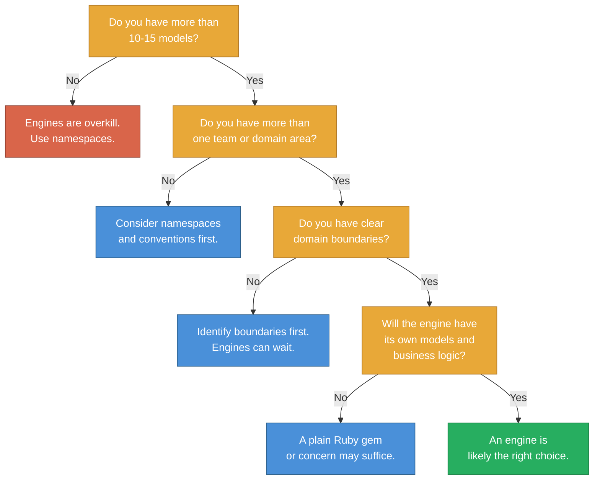
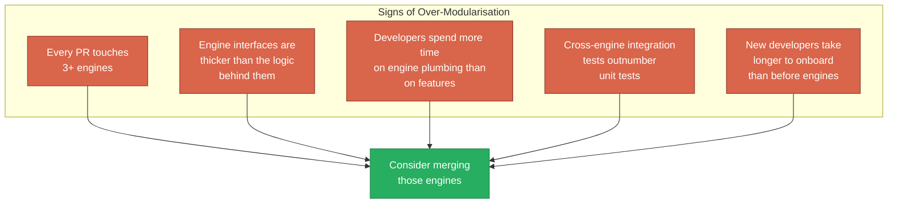

*This is an adapted excerpt from Chapter 15 of [Modular Rails: Architecture for the Long Game](/modular-rails/), my book on building maintainable Ruby on Rails applications using Rails Engines.*

---

I have spent the better part of this book making the case for Rails engines. Now I am going to tell you when not to use them.

This is not a hedge. It is honesty. Every architectural tool has a cost, and engines are no exception. Using them when they are not warranted creates overhead that slows your team down rather than speeding them up. Knowing when *not* to reach for an engine is just as important as knowing how to build one.

## The Decision Flowchart

Before introducing an engine, run through this:



Notice how many paths lead away from "use an engine." That is intentional. Engines should be the answer to a specific problem, not the default structure for every Rails application.

## Applications That Are Too Small

If your application has fewer than 10-15 models, engines almost certainly add more overhead than value. The ceremony of gemspecs, dummy apps, mountable routes, and inter-engine dependency management is not justified when the entire codebase fits comfortably in one developer's head.

For small applications, namespaces give you most of the organisational benefit at zero cost:

```ruby
# app/models/billing/invoice.rb
module Billing
  class Invoice < ApplicationRecord
    # All the billing logic, clearly namespaced
  end
end

# app/models/notifications/mailer.rb
module Notifications
  class Mailer < ApplicationRecord
    # All the notification logic, clearly namespaced
  end
end
```

This communicates domain boundaries to developers without introducing any infrastructure. The `Billing::` prefix tells you where this class belongs. The directory structure mirrors the namespace. It is not enforced, but it is clear.

## Teams That Are Too Small

A team of two or three Software Engineers working on a single application does not need engine boundaries. The communication overhead of a small team is low enough that conventions and code review are sufficient to maintain boundaries.

Engines shine when teams are large enough that not everyone can hold the full codebase in their head. If every developer on your team already knows every model, every controller, and every service object, the boundary enforcement that engines provide is solving a problem you do not have.

The threshold is not precise, but in my experience, engines start paying for themselves when you have 5+ developers working on a codebase with 30+ models across at least 2-3 distinct domain areas.

## The Honest Calculation

Before introducing engines, ask three questions:

1. **What is the actual cost of the problem we are solving?** Not the theoretical cost. The actual cost. How many hours per month does your team lose to cross-domain coupling? How many production incidents were caused by unexpected dependencies? If you cannot point to specific, recent pain, the problem may not justify the solution.

2. **What is the ongoing cost of the engine infrastructure?** Each engine needs its own gemspec, its own test setup, its own factories, its own migration strategy. Someone has to maintain that infrastructure. That someone is usually the most senior developer on the team, which means your most expensive resource is spending time on plumbing.

3. **Is there a cheaper solution that gets us 80% of the benefit?** Namespaces, conventions, Packwerk, or even just better code review might address the boundary problem without the full weight of engines.

## The Premature Boundary Trap

The most common mistake is drawing boundaries before you understand the domain. You create an `engines/billing` and an `engines/shipping` on day one, then discover three months later that billing and shipping share a concept -- "order line items" -- that does not fit neatly into either engine.

Now you have three bad options: duplicate the concept, create a third engine for shared logic, or collapse the boundary you just built. All of them are expensive. The premature boundary cost you more than having no boundary at all.

The antidote is simple: wait. Let the domain reveal its boundaries through co-change patterns (as discussed in Chapter 9) rather than guessing them up front. Six months of git history is a better domain expert than any whiteboard session.

## Signs You Have Over-Modularised

If you have already introduced engines, watch for these signals that you have gone too far:



If every pull request touches three or more engines, your boundaries are in the wrong place. If the interface code between engines is more complex than the domain logic inside them, you have created accidental complexity. If new developers are slower to become productive than they were before you introduced engines, the architecture is working against you.

The fix is not to abandon engines entirely. It is to merge the ones that should not have been separate in the first place. Collapsing a bad boundary is not failure -- it is learning.

## Alternatives That Might Be Enough

Before reaching for an engine, consider whether one of these lighter-weight alternatives solves your problem:

**Namespaces and directory structure.** Zero cost, immediate clarity. If your problem is "developers put code in the wrong place," namespaces may be all you need.

**Concerns and modules.** Shared behaviour extracted into mixins. Not a boundary mechanism, but effective for reducing duplication within a bounded context.

**Service objects.** Encapsulate a business operation in a single class. Good for complex workflows, but they do not create boundaries -- they live inside them.

**Packwerk.** Static boundary analysis without runtime isolation. If your problem is "we want to detect boundary violations" rather than "we need hard enforcement," Packwerk gives you most of the benefit at a fraction of the cost.

**Plain Ruby gems.** If the module has no Rails dependencies, a gem gives you complete isolation with minimal ceremony. A pricing calculator, a tax engine, a PDF generator -- these are gems, not engines.

Each of these tools has a place. The mature Software Engineer asks "what is the cheapest tool that solves my actual problem?" rather than "what is the most architecturally pure solution?"

---

Knowing when not to use a tool is a sign of mastery, not timidity. The best architectures are not the ones with the most boundaries. They are the ones where every boundary earns its keep.

Honesty about what your application actually needs -- not what it might need someday -- is the beginning of architectural maturity.

---

*This was adapted from Chapter 15 of [Modular Rails: Architecture for the Long Game](/modular-rails/). The book covers the full analysis including performance overhead, boot time impact, memory considerations, and route compilation costs.*

*[Get the book on Amazon UK](https://www.amazon.co.uk/dp/B0GZL7D53M) · [Amazon US](https://www.amazon.com/dp/B0GZL7D53M) · [Learn more](/modular-rails/)*
