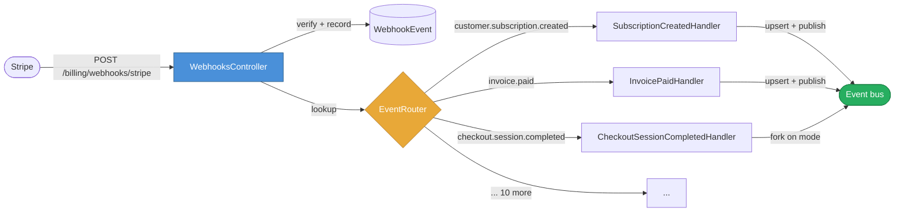

A webhook controller is the natural place to put webhook code. You name it `WebhooksController`, you put a `def stripe` action in it, and you start writing. Six months later it is 200 lines long and you cannot remember what half of it does. This post is about the moment I noticed mine had become a god object, and the small architectural shift that fixed it.

The code is real. It is from [Seams](https://github.com/Davidslv/seams), the gem I am building that scaffolds modular Rails engines. The Billing engine handles Stripe webhooks and the controller had grown to seven distinct responsibilities. I will walk you through what was wrong, what I changed, and -- more usefully -- the generalisable pattern underneath, so you can recognise the same smell in code that has nothing to do with webhooks.

## What a webhook controller actually does

When a Stripe event arrives, the controller does roughly this:

1. Read the request body.
2. Verify the Stripe signature so you know the payload is real.
3. Record the event id in your database so retries do not re-fire your subscribers.
4. Decide which Stripe event type this is.
5. Pull the relevant fields out of the payload (customer id, subscription id, amount).
6. Upsert your local mirror of the resource (a `Subscription` row, an `Invoice` row).
7. Publish a domain event for the rest of your application to react to.

That is seven verbs. Each one is a separate concern with its own reasons to change, its own failure modes, and its own testing requirements. Putting them in one place means you cannot exercise any of them in isolation, you cannot see at a glance what the controller is responsible for, and -- the part that broke me -- adding a new event type means editing the same file every time.

Mine had five event types mapped. The roadmap said twelve. Going from five to twelve in the same controller would have produced a 300-line action method with a `case` statement that nobody would want to review.

## The smell, named

The cleanest way I know to spot a god object is to write down its responsibilities as verbs. If the list is longer than three, the class is doing too much. The Single Responsibility Principle is usually taught as "a class should have one reason to change," which sounds vague until you try to change something. If two unrelated bits of code in the same file change for two unrelated reasons, you keep tripping over the other one.

The webhook controller had one reason from each of these:

- *Trust*: signature verification changes when Stripe rotates webhook signing schemes.
- *Idempotency*: dedupe logic changes when you move from a unique-index dedupe to a Redis-based one.
- *Mapping*: the event type table changes every time you support a new event.
- *Extraction*: the payload-parsing rules change when Stripe ships an API version bump.
- *Persistence*: the local upsert changes when your data model changes.
- *Publishing*: the canonical event names change when your event-bus contract changes.
- *Forking*: the LTD (Lifetime Deal) special case changes when product decides to add another mode.

Seven independent change vectors in one class. Every commit risked touching unrelated code; every test had to boot the full request stack just to exercise a single field's extraction.

## The refactor

The shape I landed on splits the controller into three layers: a thin entry point, a router, and a flat directory of single-purpose handlers.



The controller shrank from ~210 lines to about 95. Most of those 95 are documentation comments. The action itself is now ten lines:

```ruby
def stripe
  payload   = request.body.read
  signature = request.headers["Stripe-Signature"]

  event = Billing.gateway.verify_webhook(
    payload: payload, signature: signature, secret: Billing.configuration.webhook_secret
  )

  record_and_dispatch("stripe", event)
  head :ok
rescue Billing::WebhookError => e
  Seams::Observability.adapter.warn("billing.webhook.invalid", error: e.message)
  head :bad_request
end
```

`record_and_dispatch` inserts the `WebhookEvent` row inside a transaction and then calls `Webhooks::EventRouter.handler_for(event[:type])` to look up a handler class. If there is one, it instantiates and calls it; if there is not, the controller no-ops. Stripe sends event types nobody subscribed to all the time, so a missing handler is normal, not an error.

The handlers themselves form a small inheritance tree:

```
Billing::Webhooks::Handler                          ← abstract base
  ├── SubscriptionHandlerBase                       ← shared upsert
  │   ├── SubscriptionCreatedHandler                ← SEAMS_EVENT = "subscription.created.billing"
  │   ├── SubscriptionUpdatedHandler                ← "subscription.updated.billing"
  │   ├── SubscriptionDeletedHandler                ← "subscription.canceled.billing"
  │   └── SubscriptionTrialWillEndHandler           ← "subscription.trial_will_end.billing"
  ├── InvoiceHandlerBase                            ← shared upsert
  │   ├── InvoiceCreatedHandler                     (status: draft)
  │   ├── InvoicePaidHandler                        (status: paid)
  │   ├── InvoicePaymentFailedHandler               (status: open)
  │   ├── InvoiceFinalizedHandler                   (status: open)
  │   └── InvoiceVoidedHandler                      (status: void)
  ├── PaymentSucceededHandler
  ├── PaymentFailedHandler
  ├── ChargeRefundedHandler
  └── CheckoutSessionCompletedHandler               ← LTD fork lives here
```

Most leaves are three lines. `SubscriptionCreatedHandler` is literally:

```ruby
class SubscriptionCreatedHandler < SubscriptionHandlerBase
  SEAMS_EVENT = "subscription.created.billing"
end
```

The shared upsert lives in `SubscriptionHandlerBase`. The leaf only declares which canonical event name to publish. That is the entire difference between "subscription created" and "subscription updated" -- one constant.

## Three patterns, one shape

What I have just described is three classical patterns layered on top of each other.

The **Template Method** pattern is doing the heavy lifting in `SubscriptionHandlerBase`: a base class defines the algorithm (`upsert + publish`), subclasses fill in the variable parts (the canonical event name, the invoice status). When five out of six subclasses share the same logic and only the constants differ, Template Method is the right shape. It keeps the shared code in one place and makes each variant trivial to read.

The **Strategy** pattern is the relationship between the controller and the handlers: the controller does not know which handler will run; it asks the router for one and invokes it through a uniform interface (`handler.new(event:, gateway:).call`). The controller and the router are decoupled from the concrete strategy. Adding a new strategy does not require changing either of them.

The **Registry** pattern is what `EventRouter` is. It is a hash of strings to class names with a `register` method that lets hosts add their own mappings without monkey-patching. This is the seam that turns a closed system into an open one. A consuming application can write:

```ruby
Billing::Webhooks::EventRouter.register(
  "customer.tax_id.created",
  "MyApp::TaxIdCreatedHandler"
)
```

...and now a Stripe event type that the gem never heard of routes to host code. No subclassing, no config block, no fork. The extension point is published. This is what people mean when they say "open for extension, closed for modification" -- the framework's behaviour does not need to change for the host to add behaviour.

## Five concrete wins

The reason I find this shape worth talking about is that it pays off in five different ways, and the wins compound.

**Adding event types becomes a one-class job.** A new file, four lines long, registered in one place. There is no integration risk because the controller does not change. There is no "what else does this method do?" anxiety because each handler does one thing.

**Each handler is testable in isolation.** Today's controller spec used to need a full request stack. After the refactor, a handler spec is a Plain Old Object instantiated with a hash. I have a directory of saved Stripe event fixtures from Phase 3 (1/4) of the same project; a handler spec reads one, calls `.new(event:, gateway:).call`, and asserts on the resulting database state. That is a unit test, not an integration test. It runs in milliseconds.

**The Lifetime Deal fork stops being a special case.** Before: there was a `checkout_lifetime?` predicate baked into the controller, with its own branching. After: `CheckoutSessionCompletedHandler` examines `mode` and `metadata.access_type` and forks internally. The controller does not know LTDs exist. The router does not know LTDs exist. Only the handler that needs to know, knows. That is the kind of thing that lets you delete the LTD feature later -- if product changes its mind -- by deleting one file.

**Async dispatch becomes a config flip, not a code rewrite.** I shipped a `ProcessEventJob` that takes the same `(gateway:, event_data:)` arguments and calls the same router. The controller checks `Billing.configuration.process_webhooks_async` and either runs the handler in the request thread or enqueues the job. Stripe recommends responding in <100ms; hosts who need that flip a flag. Hosts who prefer the existing transactional semantics (handler failure rolls back the WebhookEvent insert, Stripe retries) keep them. *The handler did not change.*

**The extension point is published.** Hosts adding Stripe events the gem does not ship with do not have to fork the gem. They write a handler in their own codebase and call `EventRouter.register`. This is the difference between a tool you use and a tool you have to maintain a fork of.

## The trade-off, honestly

Thirteen small files where there was one large file. That is a real cost. You now have to navigate a directory tree to read all the webhook code, and someone seeing the codebase for the first time will spend a minute orienting themselves.

I think it is the right trade. Here is why.

When code is in one big file, you read it linearly. When it is in thirteen small files, you read whichever file matches the case you care about. The "navigate a directory" cost is only paid by readers who need to understand the *whole system*. Readers who only need to understand "what happens when an invoice is paid" go to one file with seven lines in it.

The opposite trade -- one big file -- is paid every time you change anything. Every commit shows up in `git blame` next to unrelated code. Every test has to set up state for the whole controller. Every bug fix risks breaking a sibling case. The cost is paid continuously, by everyone, forever.

## When this pattern does not apply

If your controller has two event types and they are stable forever, leave it alone. The refactor's value is in *case count* and *change frequency*. With two cases, the inheritance tree adds more cognitive load than it removes.

The breakeven I have seen empirically is somewhere around five cases or "I expect this to grow." Below that, a `case` statement is fine. Above that, the per-case classes start paying for themselves.

The other condition is that the cases must be *similar shape*. Webhook handlers are: each takes an event hash, optionally upserts something, publishes a canonical event. That uniformity is what makes a registry possible. If your "cases" each take different inputs and do different things, you do not have a Strategy problem -- you have a routing problem at the wrong layer.

## The generalisable lesson

The Single Responsibility Principle scales by case count. A controller with one verb has one responsibility. A controller with seven verbs has seven, and that does not feel like a problem until your case count grows enough that the verbs start interfering with each other.

When you find yourself adding the *Nth* `when` to a `case` statement, or the *Nth* `if` to a method that is already long, ask whether the cases should be classes. Not always -- it costs more files. But often enough that the question is worth asking every time.

Three follow-on principles fall out of this:

When the cases share most of the work and differ in constants, **Template Method** keeps the shared code in one place.

When the cases need to be looked up by a runtime value (an event type, a strategy name, a content type), **Registry** is the seam that lets you add cases without editing the dispatcher.

When the host application needs to add cases that the framework never anticipated, **publish the extension point**. A `register` method on a public module is worth more than any documentation telling people how to monkey-patch.

The webhook controller is just the example. The shape is everywhere.

---

*The code in this post is from [Seams](https://github.com/Davidslv/seams), an open-source gem that scaffolds modular Rails engines. The Billing engine ships the full handler hierarchy, the registry, and the opt-in async job, ready to use in your host application. If you find yourself building this pattern by hand, you might save a few hours.*

*If you want the longer story on building modular Rails applications, that is what [Modular Rails: Architecture for the Long Game](/modular-rails/) covers in depth.*
